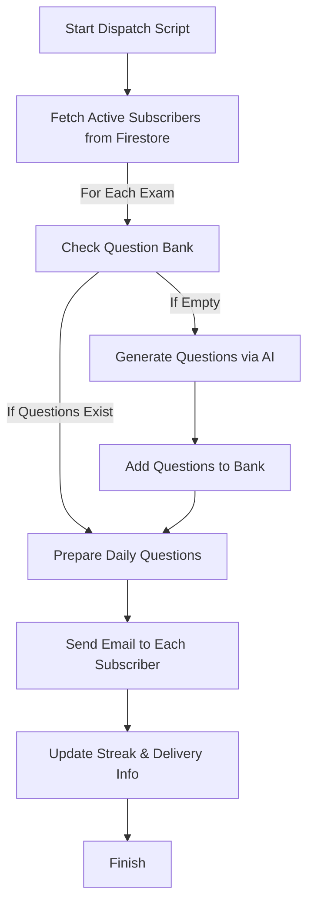
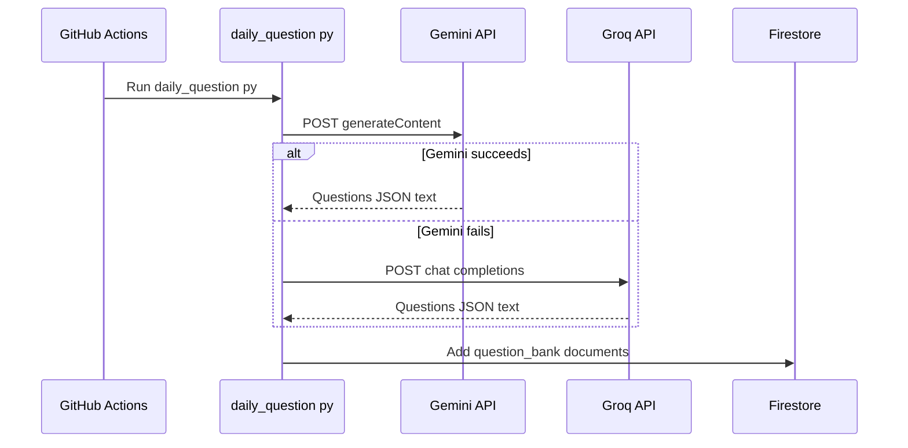
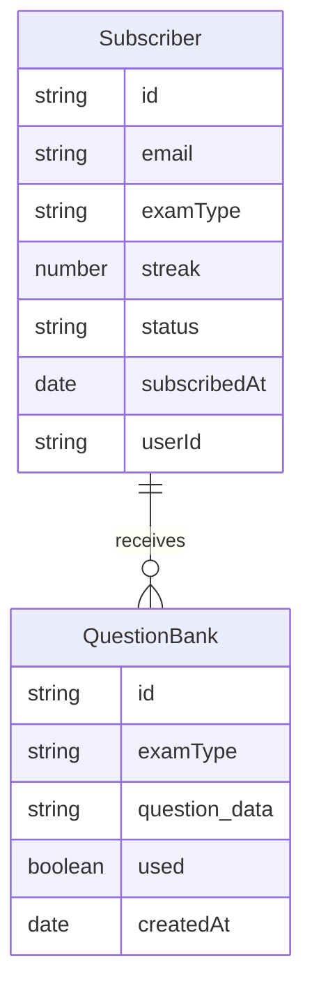
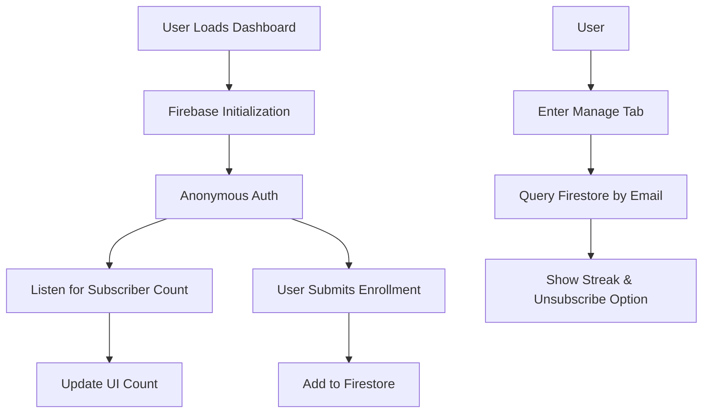
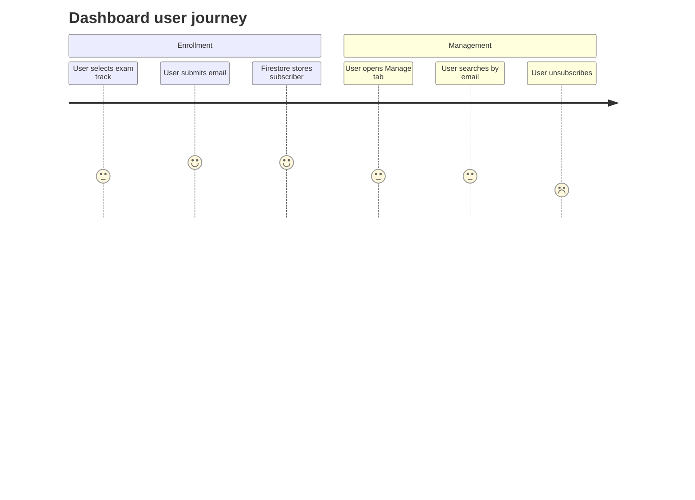

# Cloud Mastery Bot Documentation

This documentation describes the main components and architecture of the **Cloud Mastery Bot** project. The system provides daily personalized multiple-choice questions for cloud certification exams, delivered to subscribers via email and managed through a web dashboard.

---

## daily_question.py

This is the **automation and backend "brain"** of Cloud Mastery Bot. It schedules, generates, and sends daily questions to subscribers, manages the question bank using Firebase Firestore, and integrates with AI APIs for question generation.

### Key Features

- **Automated Dispatch:** Sends daily questions to all active subscribers.
- **AI Integration:** Uses Gemini and Groq (Llama-3) APIs to generate new exam questions.
- **Database Management:** Manages question bank and subscription/streak records in Firestore.
- **Email Delivery:** Sends HTML-formatted emails with daily questions, including streak tracking.

### High-Level Workflow



### Backend AI Dispatch Sequence

This diagram shows how the scheduled job interacts with Gemini, Groq, and Firestore during question generation. It follows the fallback logic implemented in the script.



---

### Configuration & Initialization

- Reads several API keys and credentials from environment variables.
- Initializes Firebase Admin SDK for Firestore access.
- **App ID** is hardcoded as `"cloud-devops-bot"` and used for scoping Firestore documents.

#### Environment Variables Required

| Variable                  | Purpose                                  |
|---------------------------|------------------------------------------|
| GEMINI_API_KEY            | Google Gemini API Key                    |
| GROQ_API_KEY              | Groq API Key (for Llama-3 fallback)      |
| EMAIL_SENDER              | Gmail sender email for SMTP              |
| EMAIL_PASSWORD            | Password or App Password for sender      |
| FIREBASE_SERVICE_ACCOUNT  | JSON for Firebase Admin SDK credential   |

---

### AI Question Generation

#### Gemini API Fallback Strategy

- Tries several Gemini API models and versions in sequence.
- Handles 404 (not found) and 429 (rate limit) responses with retries.
- If Gemini fails, falls back to **Groq Llama-3 API**.

#### Groq API Usage

- Sends prompt as a chat completion to Llama-3.
- Expects strict JSON output.

#### Example Prompt

```
Generate exactly 10 multiple-choice questions for the AZ-900 certification. Each question text MUST be extremely short (maximum 40 characters). Return a JSON array of 10 objects. Each object must have: 'question', 'options' (array of 4), 'correctIndex' (0-3), 'explanation', and 'topic'. Output ONLY the JSON array.
```

---

### Firestore Structure

- **Subscribers:**  
  `artifacts/cloud-devops-bot/public/data/subscribers`
- **Question Bank:**  
  `artifacts/cloud-devops-bot/public/data/question_bank`
- Each bank document contains:
  - `examType`
  - `question_data` (JSON string)
  - `used` (bool)
  - `createdAt`

#### Entity Relationship Diagram



---

### Email Delivery

- Sends HTML emails using **SMTP with Gmail** (`smtplib`).
- Email includes:
  - Streak count
  - Exam name
  - 1 question (short, with topic)
  - "Manage Subscription" dashboard link

---

### Main Dispatch Logic

- Collects all active subscribers and their chosen exam tracks.
- Ensures the question bank is filled for each required exam (auto-generates more if needed).
- Sends out emails and updates streak info in Firestore.

---

### Notable Functions

- `fetch_from_gemini(exam, prompt)`
- `fetch_from_groq(exam, prompt)`
- `refill_question_bank(exam)`
- `get_question_from_bank(exam)`
- `send_email(user_data, questions_json)`

---

## daily_automation.yml

This file defines the **GitHub Actions CI/CD workflow** for Cloud Mastery Bot, automating the backend job and the frontend dashboard deployment.

### Workflow Components

- **Schedule:** Runs daily at 9:00 AM UTC via cron (`30 2 * * *`)
- **Manual Trigger:** Can be run by hand or on push to `main`
- **Permissions:** Grants GitHub Pages and repo write access

---

### Jobs

#### 1. run-bot

- **Purpose:** Executes the backend Python script that sends daily questions.
- **Steps:**
  - Checks out the repo
  - Sets up Python 3.11
  - Installs dependencies (`requests`, `firebase-admin`)
  - Runs `daily_question.py` with required secrets as environment variables

#### 2. deploy-dashboard

- **Purpose:** Deploys the web dashboard to GitHub Pages.
- **Depends on:** Successful completion of `run-bot`
- **Steps:**
  - Checks out the repo
  - Injects Firebase config secret into `index.html`
  - Verifies injection
  - Uploads all files for GitHub Pages deployment

---

### Secret Injection Process

- Uses a placeholder `GITHUB_FIREBASE_CONFIG_PLACEHOLDER` in `index.html`
- Replaces the placeholder with the real Firebase config (multi-line JSON) from GitHub Secrets
- Verifies replacement before deployment

---

## requirements.txt

A basic list of Python dependencies used by `daily_question.py`:

```txt
requests
firebase-admin
```

- **requests:** For HTTP calls to AI APIs
- **firebase-admin:** For Firestore and Firebase Admin SDK

---

## index.html

This is the **frontend dashboard** for user enrollment and management.

### Features

- **Tailwind CSS:** Modern, responsive UI
- **Lucide Icons:** SVG icon support
- **Exam Path Selection:** Users pick their certification track
- **Email Enrollment:** Simple form to join daily question emails
- **Active Subscriber Count:** Real-time via Firestore
- **Subscription Management:** "Manage" tab to view streak, unsubscribe, or switch tracks
- **About & FAQ Sections:** Explains project, purpose, and usage

---

### Firebase Integration

- Uses **Firebase JS SDK (compat)** for auth and Firestore.
- Loads Firebase config from a placeholder, replaced at deployment with a secret.

---

### Main Components

| Section         | Description                                                        |
|-----------------|--------------------------------------------------------------------|
| Header          | Branding, status indicator, and navigation                         |
| Enrollment Tab  | Exam track selection, enrollment form, subscriber count            |
| Manage Tab      | Lookup and manage subscriptions by email                           |
| About           | Project rationale, features, and FAQ                               |
| Footer          | Attribution and project credit                                     |

---

### Frontend Logic (JS)

- **Exam Selection:** Highlights and tracks selected exam path.
- **Status Dot:** Updates in real-time based on Firebase connection/auth.
- **Subscribe Form:** Adds a new subscriber to Firestore.
- **Manage Form:** Lists subscriptions for an email, allows unsubscribe.
- **Firebase Auth:** Uses anonymous authentication for secure access.

---

### Real-Time Updates



### Dashboard User Journey

This diagram highlights the user experience across enrollment and management flows. It focuses on the main actions available on the dashboard.



---

### Firebase Config Injection

- Uses a strict placeholder for safe multi-line JSON replacement.
- Ensures dashboard deploys with the correct backend connection.

---

## README.md

This file is **empty**. No documentation or project description is provided in the current repository state.

The following is an example of a classic, professional README you can use for this project. It is not part of the current repository contents.

```markdown
# Cloud Mastery Bot

Cloud Mastery Bot is a lightweight automation and dashboard project that delivers **daily cloud certification questions** by email.  
It combines AI-generated multiple-choice questions with a simple enrollment and management interface powered by Firebase and GitHub Actions.

---

## Features

- 🎓 Daily multiple-choice questions for popular Azure fundamentals exams.
- 🤖 AI-powered question generation using Gemini and Groq Llama models.
- 📬 Automated email delivery with streak tracking for each subscriber.
- 🌐 Minimal, static enrollment dashboard hosted on GitHub Pages.
- 🔥 Real-time subscriber count and subscription management.

---

## Tech Stack

- **Backend Automation:** Python, `firebase-admin`, `requests`, `smtplib`
- **Infrastructure:** GitHub Actions, GitHub Pages
- **Database:** Firebase Firestore
- **Frontend:** HTML, Tailwind CSS, Lucide Icons, Firebase JS SDK

---

## Repository Structure

```text
.
├── daily_question.py       # Python automation script for daily dispatch
├── daily_automation.yml    # GitHub Actions workflow configuration
├── index.html              # Enrollment and subscription management dashboard
├── requirements.txt        # Python dependencies for the bot
└── README.md               # Project documentation (this file)
```

---

## Getting Started

Follow these steps to run the automation locally.

1. Clone the repository:

   ```bash
   git clone https://github.com/<your-account>/cloud-mastery-bot.git
   cd cloud-mastery-bot
   ```

2. Create and activate a virtual environment (optional but recommended):

   ```bash
   python -m venv .venv
   source .venv/bin/activate  # On Windows: .venv\Scripts\activate
   ```

3. Install Python dependencies:

   ```bash
   pip install -r requirements.txt
   ```

4. Set the required environment variables in your shell:

   ```bash
   export GEMINI_API_KEY=your_gemini_key
   export GROQ_API_KEY=your_groq_key
   export EMAIL_SENDER=your_sender_email
   export EMAIL_PASSWORD=your_sender_password
   export FIREBASE_SERVICE_ACCOUNT='{"type":"service_account", ...}'
   ```

5. Run the daily dispatch script manually:

   ```bash
   python daily_question.py
   ```

---

## Automation Workflow

This project uses GitHub Actions to run the bot on a schedule and deploy the dashboard.

- **Workflow file:** `daily_automation.yml`
- **Jobs:**
  - `run-bot` – runs `daily_question.py` with secrets provided by GitHub.
  - `deploy-dashboard` – injects Firebase config into `index.html` and deploys to GitHub Pages.
- **Schedule:** The workflow runs automatically on a daily cron schedule.

---

## Environment Variables

The following environment variables are required by the Python script:

| Variable                 | Description                                  |
|--------------------------|----------------------------------------------|
| `GEMINI_API_KEY`         | Google Gemini API key                        |
| `GROQ_API_KEY`           | Groq API key for Llama-based fallback        |
| `EMAIL_SENDER`           | SMTP sender email address                    |
| `EMAIL_PASSWORD`         | SMTP password or app password                |
| `FIREBASE_SERVICE_ACCOUNT` | JSON for Firebase Admin SDK service account |

In GitHub Actions, these values are stored as **repository secrets** and mapped into the workflow environment.

---

## Dashboard

The dashboard is a single-page HTML application served by GitHub Pages.

- Lets users enroll in a specific exam track using their email.
- Shows the live number of active subscribers from Firestore.
- Provides a **Manage** tab for searching and unsubscribing records.

```text
index.html
 ├─ Tailwind CSS-based layout and styling
 ├─ Lucide icons for visual cues
 └─ Firebase JS SDK for Firestore and anonymous auth
```

---

## License

You can attach any license text appropriate for your project here, such as MIT, Apache-2.0, or a custom license.
```

---

# API Documentation

> **Note:** The `daily_question.py` script does not expose an HTTP API; all automation is backend and email-based. No REST or HTTP endpoints are present.

---

# Key Behaviors & Implementation

```card
{
    "title": "Automated AI-Driven Dispatch",
    "content": "The system sends AI-generated daily cloud exam questions to subscribers via email, managing streaks and questions in Firestore."
}
```

```card
{
    "title": "Multi-Provider AI Fallback",
    "content": "If Gemini API fails, the bot automatically switches to Groq (Llama-3) for question generation, maximizing reliability."
}
```

```card
{
    "title": "Deployment Security",
    "content": "Sensitive Firebase config is injected securely into the deployed dashboard at build time—never stored in source code."
}
```

---

# Summary Table

| Component          | Role                                            |
|--------------------|------------------------------------------------|
| daily_question.py  | Backend dispatch, email sending, AI question gen|
| daily_automation.yml| CI/CD: Runs backend, deploys dashboard         |
| requirements.txt   | Python dependencies                            |
| index.html         | Web dashboard for enrollment/management         |
| README.md          | (Empty in current repository)                   |

---

# Usage Notes

- **Enrollment:** Users sign up on the dashboard for daily emails.
- **Management:** Users can change tracks or unsubscribe via the dashboard.
- **Automation:** All dispatch and deployment is handled by GitHub Actions as per `daily_automation.yml`.

---

# Security Note

All credentials and sensitive config are managed via **GitHub Secrets** and injected only at runtime or deployment—never committed to the repository.

---
