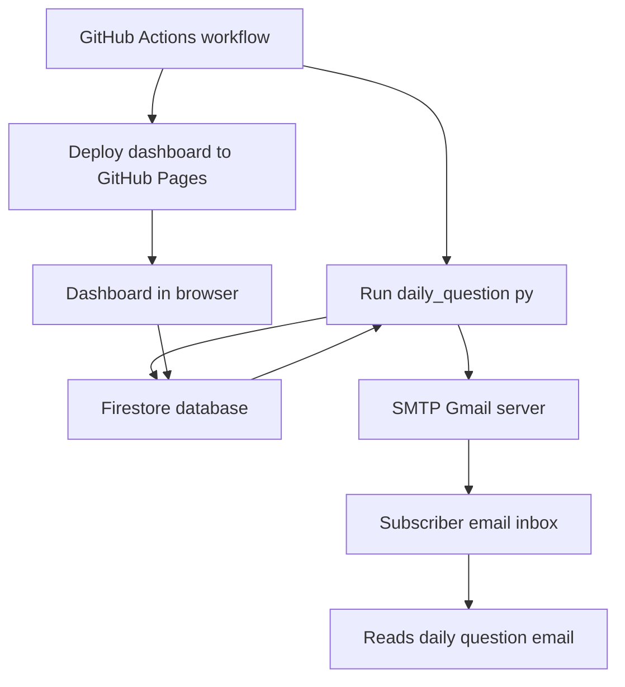
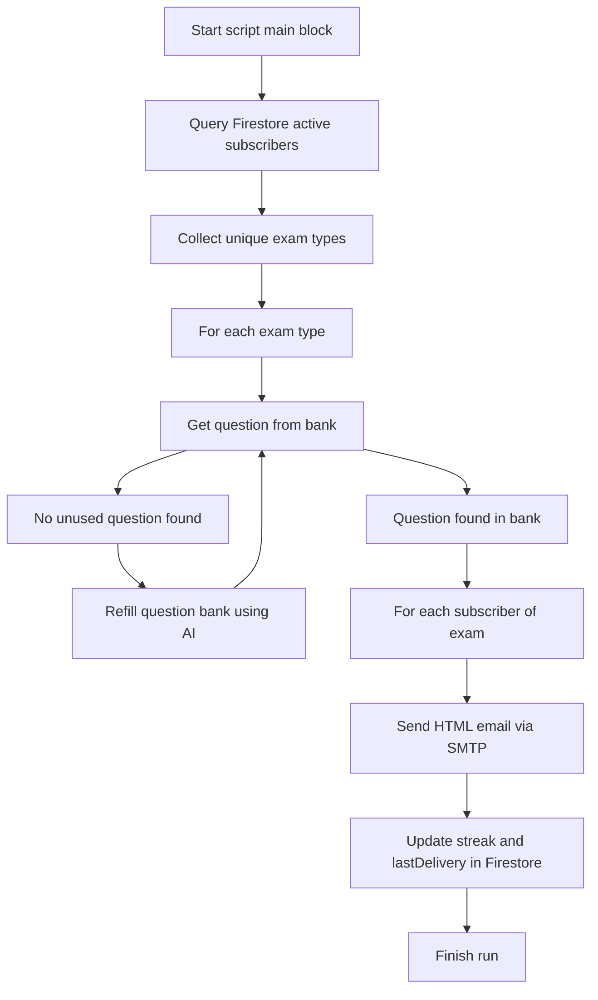
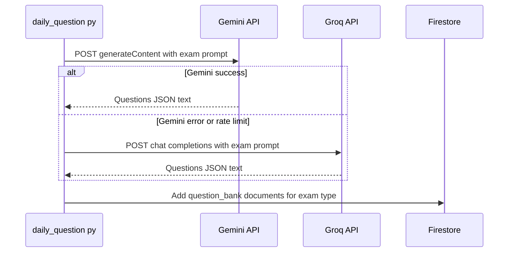
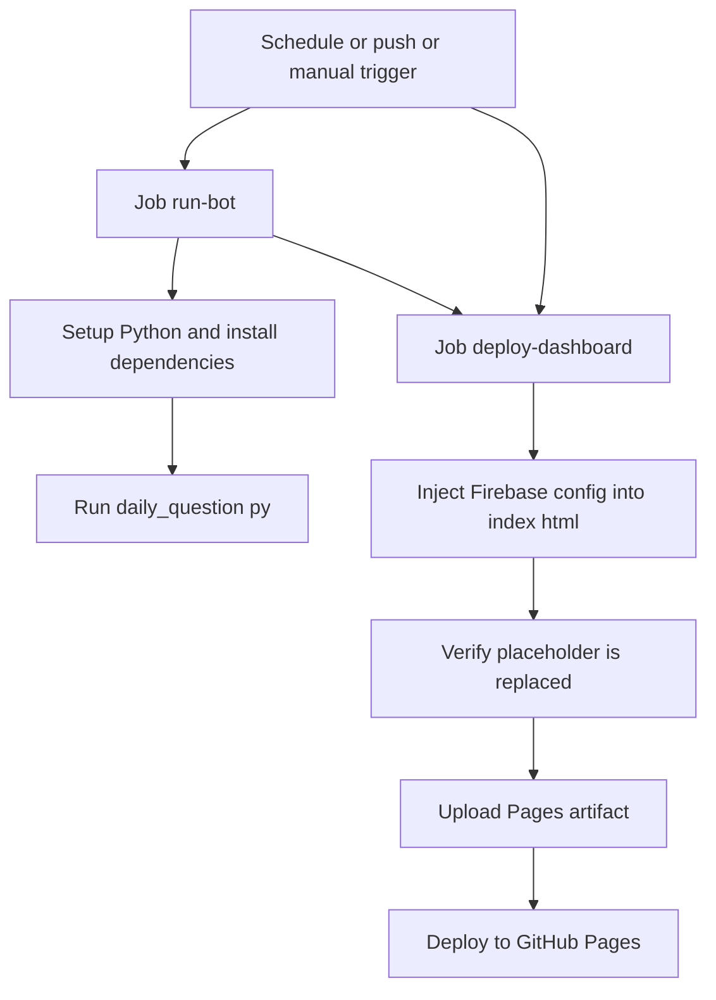
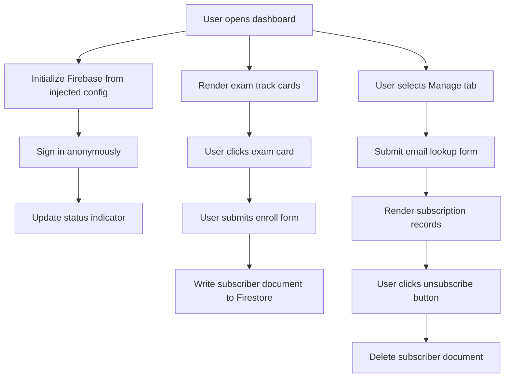
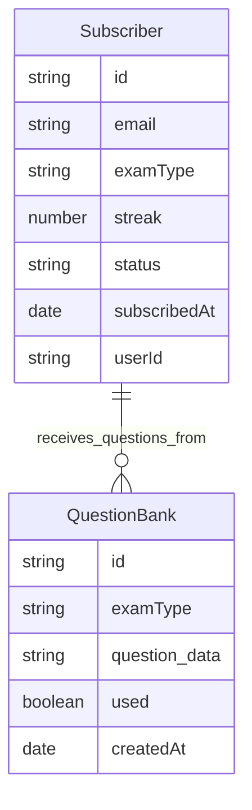

# Cloud Mastery Bot ✨

Cloud Mastery Bot delivers **daily cloud certification questions** to subscribers by email. It uses **AI models**, **Firebase Firestore**, and **GitHub Actions** to automate generation, storage, and delivery of short multiple-choice questions.

---

## Overview 💡

This repository combines a **Python automation script**, a **GitHub Actions workflow**, and a **static dashboard**. Together they handle question generation, scheduling, email dispatch, and subscription management.

- **Automation:** `daily_question.py` runs as a scheduled job.
- **Deployment:** `daily_automation.yml` deploys the dashboard and runs the bot.
- **Dashboard:** `index.html` provides enrollment and management UI.
- **Storage:** Firestore stores subscribers and question bank data.

---

## Components 🧩

The following table summarizes the main files and their roles.

| File                   | Purpose                                                         |
|------------------------|-----------------------------------------------------------------|
| `daily_question.py`    | Generates questions, manages Firestore, and sends emails       |
| `daily_automation.yml` | GitHub Actions workflow for scheduling and deployment          |
| `index.html`           | Single-page enrollment and subscription management dashboard   |
| `requirements.txt`     | Python dependencies for the automation script                  |
| `README.md`            | Project documentation                                          |

---

## System Architecture Flow 🏗️

This diagram shows how automation, AI services, Firestore, email, and the dashboard interact. It highlights the core data paths in the system.



---

## Backend Automation (`daily_question.py`) ⚙️

This script is the **automation engine** that runs once per day. It reads subscribers from Firestore, ensures there are questions for each exam, and sends formatted HTML emails via SMTP.

- Uses **environment variables** for all credentials and API keys.
- Initializes **Firebase Admin SDK** using a service account JSON.
- Integrates with **Gemini** and **Groq** APIs for question generation.
- Updates subscriber **streak** and **lastDelivery** fields in Firestore.

### Dispatch Flow 🚀

The following flow describes the main path executed in the `__main__` block. It shows how subscribers, questions, and streak updates connect.



### AI Question Generation Flow 🤖

The script uses Gemini first, then falls back to Groq if necessary. It stores all generated questions in a Firestore collection named `question_bank`.



---

## GitHub Actions Workflow (`daily_automation.yml`) 🧾

The workflow automates both the **daily bot run** and the **deployment of the dashboard**. It uses repository secrets to provide credentials and Firebase configuration at runtime.

- Triggers on **cron schedule**, **push to main**, and **manual dispatch**.
- **Job `run-bot`:** sets up Python and executes `daily_question.py`.
- **Job `deploy-dashboard`:** injects Firebase config into `index.html` and deploys to Pages.

### Workflow Execution Diagram 📆



---

## Frontend Dashboard (`index.html`) 🖥️

The dashboard is a static HTML file styled with **Tailwind CSS**. It uses **Firebase JS SDK (compat)** to connect to Firestore and supports **anonymous authentication**.

- **Enroll tab:** lets users select an exam and enter an email.
- **Manage tab:** lets users search existing subscriptions and unsubscribe.
- **Status indicator:** shows connection state to Firebase.
- **Global count:** shows the number of documents in the `subscribers` collection.

### Dashboard User Flow 🧭



---

## Data Model (Firestore) 🗄️

The automation and dashboard share a **Firestore data model**. Data is stored under the `artifacts` collection, scoped by the constant `APP_ID = "cloud-devops-bot"`.

- **Subscribers path:** `artifacts/cloud-devops-bot/public/data/subscribers`
- **Question bank path:** `artifacts/cloud-devops-bot/public/data/question_bank`



---

## Installation and Usage 🛠️

You can run the Python automation locally using the provided `requirements.txt`. The script reads configuration from environment variables and interacts directly with your Firebase project.

- Install dependencies with `pip` using `requirements.txt`.
- Set environment variables for Gemini, Groq, SMTP, and Firebase service account JSON.
- Run `python daily_question.py` to execute one dispatch cycle.

```bash
pip install -r requirements.txt
python daily_question.py
```

All configuration values must match the ones used by your Firebase project and email provider.
